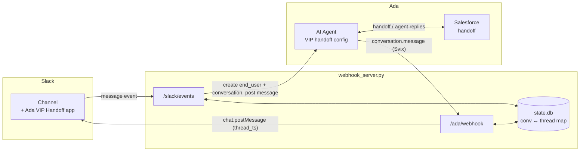
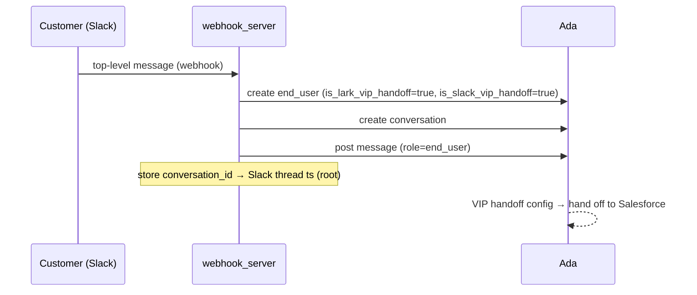
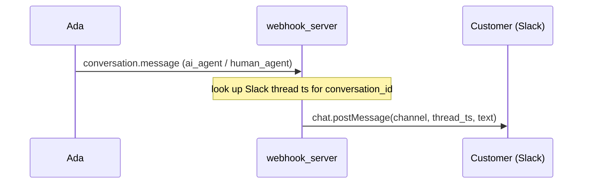

# Slack ↔ Ada VIP Handoff

Bridges a **Slack channel** to an **Ada AI Agent** so that VIP customers can be
served — and handed off to a live agent (via Salesforce) — without leaving Slack.

A customer's message in the Slack channel is mirrored into Ada; Ada's greeting and
the human agent's replies are mirrored back into the customer's Slack thread. The
whole exchange stays in one Slack thread per conversation.

- **Event-driven** (webhooks) — replies appear in near real time, no polling.
- **Stateless per message** for new conversations, thread-aware for follow-ups.
- **Self-contained** — one small Python service, no framework lock-in.

---

## Contents

- [Architecture](#architecture)
- [How it works](#how-it-works)
- [Prerequisites](#prerequisites)
- [Configuration](#configuration)
- [How to obtain each value](#how-to-obtain-each-value)
- [Run locally](#run-locally)
- [Deployment](#deployment) — 3 hosting options
- [Registering the webhooks](#registering-the-webhooks)
- [Security](#security)
- [Observability & logging](#observability--logging)
- [Testing](#testing)
- [Demo mode (no live Salesforce needed)](#demo-mode-no-live-salesforce-needed)
- [Repository & access](#repository--access)
- [Troubleshooting](#troubleshooting)

---

## Architecture

One Python (Flask) service exposes two webhook endpoints. Slack pushes customer
messages to one; Ada pushes agent/AI messages to the other.



**Inbound** (customer → Ada):



**Outbound** (agent/AI → customer):



---

## How it works

### Routing model
- **A new top-level message** in the channel → a **fresh Ada end user + a new
  conversation**. Ada's VIP handoff config fires and hands off to Salesforce.
- **A reply inside an existing thread** (its `thread_ts` differs from its own `ts`)
  → **continues that thread's Ada conversation** (mapped by the thread's root `ts`).
- The server **ignores its own messages** (`bot_id` set, or the sender is the bot's
  own user id) so relayed agent replies are never fed back into Ada (no echo / no
  loop).

### Why the customer is flagged
Each end user is created with `profile.metadata.is_slack_vip_handoff = true` **and**
`is_lark_vip_handoff = true` (plus a `channel_link` and the originating Slack
message `ts`). The `is_lark_vip_handoff` key is what triggers the Salesforce
handoff on the Ada instance today, regardless of the platform name — this is set
automatically by the server, no action needed. `is_slack_vip_handoff` is also set,
for bookkeeping on this integration. If the underlying handoff mechanism is ever
renamed or replaced on the Ada side, check with your Ada contact so this server can
be re-pointed at whatever replaces it.

### State
A tiny SQLite file (`webhook_state.db`) holds two mappings
(`conversation_id ↔ Slack root message ts`) and a de-dup set of processed event ids
(both Slack and Ada/Svix retry deliveries, so de-dup prevents double-posting).

### Files
| File | Purpose |
|---|---|
| `webhook_server.py` | The service — both webhook endpoints + Ada/Slack clients |
| `.env.example` | Every required setting (copy to `.env`, fill in) |
| `requirements.txt` | Python dependencies (runtime) |
| `requirements-dev.txt` | Test dependencies (`pytest`) |
| `tests/` | Unit tests — run `pytest` (see [Testing](#testing)) |
| `demo/fake_agent_server.py` | Local human-agent stand-in for demoing the handoff-reply path without a live Salesforce agent (see [Demo mode](#demo-mode-no-live-salesforce-needed)) |
| `.gitignore` | Keeps secrets/state/logs out of git |

---

## Prerequisites

- **Python 3.9+**
- Access to your **Ada** instance (admin, or an API key you can create/obtain).
- A **Slack app** with a bot user, installed to the target workspace and invited
  to the target channel.
- A **publicly reachable HTTPS URL** for the server (see [Deployment](#deployment)).

You don't need the credentials/IDs in hand yet —
[**How to obtain each value**](#how-to-obtain-each-value) walks through getting
every single one, step by step, with copy-paste commands.

---

## Configuration

Copy `.env.example` to `.env` and fill it in (never commit `.env`):

```bash
cp .env.example .env
```

| Variable | Where it comes from |
|---|---|
| `ADA_BASE_URL` | e.g. `https://<instance>.ada.support` |
| `ADA_API_KEY` | Ada Conversations API key |
| `ADA_CHANNEL_ID` | the custom channel id conversations are created on |
| `ADA_WEBHOOK_SECRET` | Svix signing secret (`whsec_…`) — see [Registering](#registering-the-webhooks) |
| `SLACK_BOT_TOKEN` | the app's bot token (`xoxb-…`) |
| `SLACK_SIGNING_SECRET` | the app's Signing Secret |
| `SLACK_CHANNEL_ID` | the channel id (`C…`/`G…`) this server serves |
| `CHANNEL_JOIN_LINK` | permanent channel link shown to the agent |
| `PORT` | default `8080` |

> The server **fails to start** unless `SLACK_SIGNING_SECRET` is set — this is
> deliberate, so the public endpoint can never accept unauthenticated events.
> Unlike Lark (token-or-encryption), Slack has exactly one signing mechanism, so
> it's a hard requirement rather than a choice.

The table says *where* each value lives; the next section shows *exactly how to
get each one*.

---

## How to obtain each value

Do this before running the server. Every value comes from either your Ada instance
or your Slack app.

### Ada

**`ADA_BASE_URL`** — your instance URL: `https://<instance>.ada.support`.

**`ADA_API_KEY`** — in Ada, click **Config** (the gear, bottom-left) → **Platform →
API keys** → **Add key**, grant it webhook + conversation permissions, and copy the
generated key. That string is your Bearer token. If you can't create keys, ask an
Ada admin to issue one.

**`ADA_CHANNEL_ID`** — the custom channel your conversations are created on. If you
administer Ada, find it under **Config → Channels** (or create a channel there);
otherwise ask your Ada admin/contact for the channel id. Use a **separate** channel
from any existing Lark/other integration — don't reuse one across platforms.

**`ADA_WEBHOOK_SECRET`** — you don't have this yet. It's generated when you register
the outbound webhook — see [Registering the webhooks](#registering-the-webhooks),
which creates the endpoint and then fetches its `whsec_…` secret.

### Slack

Do these **in order** — the later steps use the app credentials from step 1.

**1. Create the app → `SLACK_SIGNING_SECRET`.**
Go to [api.slack.com/apps](https://api.slack.com/apps) → **Create New App** →
"From scratch". Name it (e.g. "Ada VIP Handoff") and pick the target workspace.
Open **Basic Information → App Credentials** and copy the **Signing Secret**.

**2. Add bot scopes → install → `SLACK_BOT_TOKEN`.**
Under **OAuth & Permissions → Scopes → Bot Token Scopes**, add:
- `chat:write` — post replies into the thread
- `channels:history` — read messages in public channels (or `groups:history` if the
  target channel is private)
- `channels:read` / `groups:read` — resolve channel info (used for `CHANNEL_JOIN_LINK`)

Then **Install to Workspace** at the top of that page (this needs a workspace admin
to approve). Copy the **Bot User OAuth Token** (`xoxb-…`).

**3. Subscribe to the `message.channels` event.**
Under **Event Subscriptions**, turn it on, and once the Request URL (Step 5 below)
verifies, add the bot event `message.channels` (or `message.groups` for a private
channel). Save — this usually requires **reinstalling the app** to the workspace
for the new scope/event to take effect.

**4. Invite the bot to the target channel.**
Follow [`CUSTOMER_SLACK_BOT_SETUP.md`](CUSTOMER_SLACK_BOT_SETUP.md). The bot must be
a **member of the channel** or it can neither read nor post there.

**5. `SLACK_CHANNEL_ID`** (the `C…`/`G…` id of that channel). Easiest from the
channel itself: **Channel name → View channel details** — the ID is at the bottom
of that panel. Or via the API with the bot token:
```bash
curl -s "https://slack.com/api/conversations.list?types=public_channel,private_channel" \
  -H "Authorization: Bearer $SLACK_BOT_TOKEN"
# find your channel in the list → its "id" is SLACK_CHANNEL_ID
```

**6. `CHANNEL_JOIN_LINK`** — a permanent link to the channel, shown to the agent so
they can open the customer's Slack thread. This is just the channel's URL:
`https://<your-workspace>.slack.com/archives/<SLACK_CHANNEL_ID>`.

---

## Run locally

```bash
pip install -r requirements.txt
set -a; source .env; set +a           # load .env (handles quoted values)
python3 webhook_server.py             # dev server on :8080
```

To receive live webhooks during development, expose the local server with a
tunnel (no deploy needed):

```bash
cloudflared tunnel --url http://localhost:8080
# → prints a https://<random>.trycloudflare.com URL
```

Use that URL when [registering the webhooks](#registering-the-webhooks). Note the
quick-tunnel URL is **ephemeral** — it changes each run. For anything lasting, use
a real deployment below.

---

## Deployment

Pick one. All three give you the stable public HTTPS URL the webhooks need.

### Option 1 — Cloudflare Tunnel + any host (recommended: cheapest, no open ports)
Run the service on any always-on box (even a small VM or an on-prem machine) and
expose it with a **named** Cloudflare Tunnel bound to a subdomain you control.
No inbound ports opened, TLS handled by Cloudflare, free.

```bash
# one-time
cloudflared tunnel login
cloudflared tunnel create slack-ada
cloudflared tunnel route dns slack-ada handoff.yourdomain.com
# run (alongside the app)
cloudflared tunnel run slack-ada          # maps to http://localhost:8080
gunicorn -w 2 -b 127.0.0.1:8080 webhook_server:app
```
Public URL → `https://handoff.yourdomain.com`.

### Option 2 — Small cloud VM (most control)
A t4g.nano / e2-micro / small droplet (~$5/mo). Run the app under gunicorn behind
Caddy (which does automatic Let's Encrypt TLS):

```bash
gunicorn -w 2 -b 127.0.0.1:8080 webhook_server:app
# Caddyfile:  handoff.yourdomain.com { reverse_proxy 127.0.0.1:8080 }
```
Run both under systemd so they restart on boot/crash.

### Option 3 — Managed PaaS (least ops)
Push to **Render**, **Railway**, or **Fly.io** — they build from
`requirements.txt`, give you managed TLS and a stable URL, and cover this traffic
on their free/low tiers. Set the start command to
`gunicorn -w 2 -b 0.0.0.0:$PORT webhook_server:app` and add the `.env` values as
the platform's secrets/environment variables.

> Whichever you choose, once you have the stable URL you must
> [re-register both webhooks](#registering-the-webhooks) to point at it.

---

## Registering the webhooks

Two endpoints, two places. Replace `https://YOUR_URL` with your deployed base URL.

### 1. Slack inbound → `https://YOUR_URL/slack/events`
In the Slack app config for "Ada VIP Handoff" → **Event Subscriptions**:
1. Turn Event Subscriptions **on**.
2. Set **Request URL** to `https://YOUR_URL/slack/events` and save. Slack sends a
   verification challenge; the running server answers it automatically (this
   requires the server to already be deployed and reachable at that URL).
3. Under **Subscribe to bot events**, add `message.channels` (public channel) or
   `message.groups` (private channel) to match your target channel's type.
4. **Reinstall the app** to the workspace so the new event subscription takes
   effect.

### 2. Ada outbound → `https://YOUR_URL/ada/webhook`
Create the endpoint with the Ada Platform API (the dashboard's embedded panel
works too, but the API is scriptable):

```bash
# create — subscribed to conversation messages
curl -X POST "$ADA_BASE_URL/api/v2/webhooks/" \
  -H "Authorization: Bearer $ADA_API_KEY" -H "Content-Type: application/json" \
  -d '{"url":"https://YOUR_URL/ada/webhook",
       "event_filters":["v1.conversation.message"],
       "enabled":true,
       "description":"Slack VIP handoff outbound relay"}'
# → { "id": "ep_…", ... }

# fetch the signing secret → put in .env as ADA_WEBHOOK_SECRET
curl "$ADA_BASE_URL/api/v2/webhooks/<ep_id>/secret/" \
  -H "Authorization: Bearer $ADA_API_KEY"
# → { "key": "whsec_…" }
```

Restart the server after setting `ADA_WEBHOOK_SECRET`.

> Ada webhook endpoints can't be channel-scoped via the API, so the endpoint
> receives *all* conversation messages; the server safely ignores any conversation
> it has no Slack thread mapping for.

---

## Security

- **Inbound (Slack)** requests are authenticated by the request-signing secret
  (`X-Slack-Signature`, HMAC-SHA256 over `v0:{timestamp}:{body}`) plus a 5-minute
  replay window on `X-Slack-Request-Timestamp`. The server **refuses to start**
  without a signing secret set, and rejects unsigned/forged/stale requests with
  `401`.
- **Outbound (Ada/Svix)** requests are verified with the Svix signing secret
  (official `svix` lib, HMAC fallback), including timestamp replay protection.
- All signature comparisons are **constant-time**.
- Secrets live only in `.env` (git-ignored). No credentials or conversation IDs
  are hard-coded — everything is dynamic and per-message.
- The bot's own messages are ignored (`bot_id`, or sender == the bot's own user
  id), preventing relay loops.

---

## Observability & logging

The service logs to **stdout** (captured by systemd/journald, Docker, or your
PaaS log stream) and, if `LOG_FILE` is set, **also** to a rotating file you can zip
and send to Ada if something breaks.

**Configure it** (in `.env` / platform env vars):

| Var | Default | Effect |
|---|---|---|
| `LOG_LEVEL` | `INFO` | `INFO` logs the lifecycle, every routing decision, and all errors. `DEBUG` additionally logs raw payloads and **full** message text (verbose; includes customer content). `WARNING` = auth rejects + errors only. |
| `LOG_FILE` | *(unset)* | If set (e.g. `/var/log/slack-ada/app.log`), also writes there, rotating at 5 MB × 5 files. Blank = stdout only. |

**What a log line looks like.** Every request gets a short id (`[a1b2c3d4]`) so all
its lines group together, and every line carries the `conv=`/`ts=`/`thread=` ids so
you can **grep one conversation across both directions**:

```
2026-08-13T20:30:01+0800 INFO  [slack_ada] [a1b2c3d4] slack->ada NEW conv=6a63… end_user=5f1… ts=1723… text='my card is blocked'
2026-08-13T20:30:03+0800 INFO  [slack_ada] [9f8e7d6c] ada->slack RELAYED role=ai_agent conv=6a63… thread=1723… msg=msg_1 text='Hi, connecting you…'
```

- **Auth rejects** log at `WARNING` with the client IP (`slack.auth REJECT reason=… ip=…`).
- **API failures** log at `ERROR` with the HTTP status and response body — this is
  the line to look for when a message didn't get through.
- **Every drop is logged with a reason** (`slack.skip reason=own_bot`,
  `ada->slack NO THREAD mapped …`), so "my message didn't appear" is diagnosable
  from the logs alone.
- **`GET /health`** returns liveness plus a state readout (configured channel, whether
  each secret is set, and how many conversations/events are mapped) — one curl tells
  you if the instance is up and correctly wired.

**If you hit an issue, send Ada:** the `LOG_FILE` (or the stdout capture) for the
time window, the affected Slack message ts / Ada conversation id, and the `/health`
output. Set `LOG_LEVEL=DEBUG` first if the INFO logs don't show the cause.

**External logs that also help:** Ada dashboard → Config → Platform → Webhooks shows
per-delivery **Logs + replay** (Svix) for the outbound side; the Slack app config →
Event Subscriptions shows recent delivery errors for the inbound side.

---

## Testing

Unit tests exercise both endpoints through Flask's test client with the Ada/Slack
network calls mocked — no live instance needed.

```bash
pip install -r requirements-dev.txt
pytest
```

They cover: signature reject (bad/missing signature), the URL-verification handshake,
top-level → new-conversation vs thread-reply → continue routing, the relay-loop guard
(bot's own messages via `bot_id` or its own user id), event dedup, the outbound relay,
and fail-closed behaviour without the Ada secret. Run them before deploying and after
any change to `webhook_server.py`.

---

## Demo mode (no live Salesforce needed)

If the customer's Salesforce↔Ada VIP handoff isn't confirmed wired yet, you can still
demo the full round trip — including the "agent replies" half — with
`demo/fake_agent_server.py`. It posts a `human_agent` message straight into the Ada
conversation via the Conversations API; that message then relays into the Slack
thread through the normal `/ada/webhook` path, exactly as a real agent's reply would.

```bash
export ADA_API_KEY="<your Ada API key>"
python3 demo/fake_agent_server.py
# in another terminal, once you have a conversation_id from the server logs:
curl -X POST localhost:8765/reply \
  -H "Content-Type: application/json" \
  -d '{"conversation_id": "<conv_id from the logs>", "message": "Hi, this is Sarah, how can I help?"}'
```

---

## Repository & access

This service is intended to run in **your own environment**, with your own Ada
and Slack credentials.

- To grant a teammate access to this repository, share their **GitHub username**
  with the repo owner and they'll be added as a collaborator.
- Before first run, each environment supplies its own `.env` — the repo ships only
  `.env.example`. Never commit a real `.env`, `*.db`, or logs (already handled by
  `.gitignore`).

---

## Troubleshooting

| Symptom | Likely cause |
|---|---|
| Server won't start | `SLACK_SIGNING_SECRET` unset |
| Slack URL verification fails | server not reachable at the public URL, or signature check failing |
| `/ada/webhook` returns 401 | `ADA_WEBHOOK_SECRET` missing/wrong; restart after setting it |
| Agent replies don't reach Slack | Ada endpoint not enabled, or no thread mapping for that conversation (was it started from a Slack message we're tracking?) |
| Duplicate messages | more than one relay running, or the app reinstalled with a stale Request URL still registered elsewhere |
| Customer replies open a new thread instead of continuing | they replied in the main channel, not inside the thread — by design, a top-level message starts a new conversation |
| Bot can't see any messages in the channel | bot not invited to the channel, or missing `channels:history`/`groups:history` scope |

**First stop for any issue: the logs.** Grep the affected id — e.g.
`grep 'conv=6a63' app.log` (or `journalctl -u slack-ada | grep 1723`) — to see
exactly where that message stopped. Every drop is logged with a reason. Raise
verbosity with `LOG_LEVEL=DEBUG` and restart if the cause isn't clear at INFO. See
[Observability & logging](#observability--logging).
